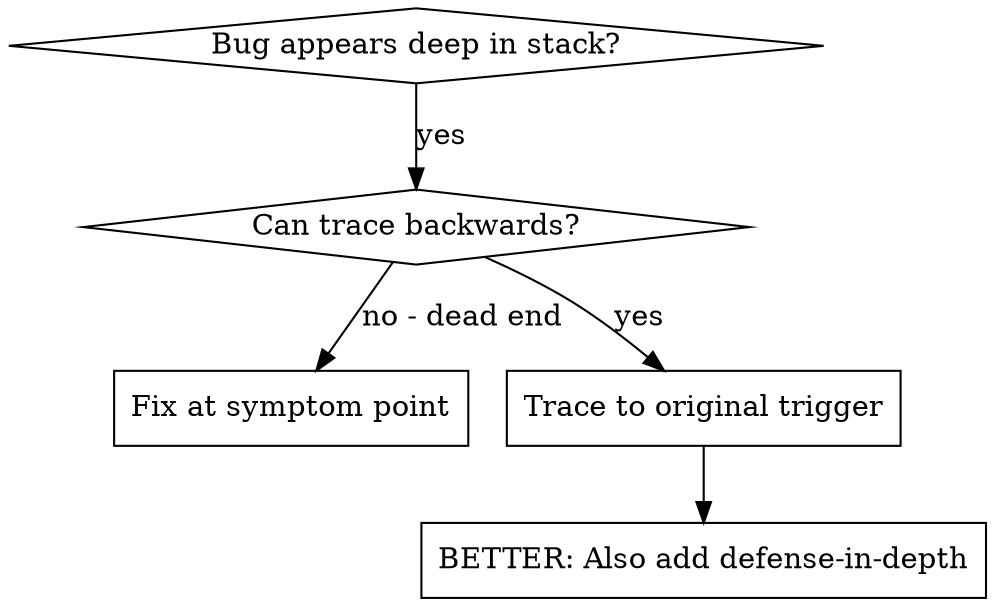
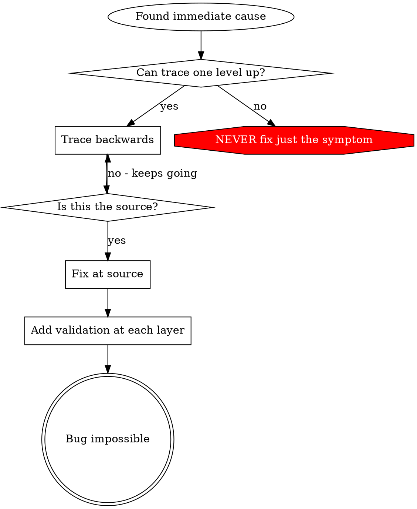

# Root Cause Tracing

## Overview

Bugs often manifest deep in the call stack (git init in wrong directory, file created in wrong location, database opened with wrong path). Your instinct is to fix where the error appears, but that's treating a symptom.

**Core principle:** Trace backward through the call chain until you find the original trigger, then fix at the source.

## When to Use



**Use when:**
- Error happens deep in execution (not at entry point)
- Stack trace shows long call chain
- Unclear where invalid data originated
- Need to find which test/code triggers the problem

## The Tracing Process

### 1. Observe the Symptom
```
Error: git init failed in /Users/jesse/project/packages/core
```

### 2. Find Immediate Cause
**What code directly causes this?**
```typescript
await execFileAsync('git', ['init'], { cwd: projectDir });
```

### 3. Ask: What Called This?
```typescript
WorktreeManager.createSessionWorktree(projectDir, sessionId)
  → called by Session.initializeWorkspace()
  → called by Session.create()
  → called by test at Project.create()
```

### 4. Keep Tracing Up
**What value was passed?**
- `projectDir = ''` (empty string!)
- Empty string as `cwd` resolves to `process.cwd()`
- That's the source code directory!

### 5. Find Original Trigger
**Where did empty string come from?**
```typescript
const context = setupCoreTest(); // Returns { tempDir: '' }
Project.create('name', context.tempDir); // Accessed before beforeEach!
```

## Adding Stack Traces

When you can't trace manually, add instrumentation:

```typescript
// Before the problematic operation
async function gitInit(directory: string) {
  const stack = new Error().stack;
  console.error('DEBUG git init:', {
    directory,
    cwd: process.cwd(),
    nodeEnv: process.env.NODE_ENV,
    stack,
  });

  await execFileAsync('git', ['init'], { cwd: directory });
}
```

**Critical:** Use `console.error()` in tests (not logger - may not show)

**Run and capture:**
```bash
npm test 2>&1 | grep 'DEBUG git init'
```

**Analyze stack traces:**
- Look for test file names
- Find the line number triggering the call
- Identify the pattern (same test? same parameter?)

## Finding Which Test Causes Pollution

If something appears during tests but you don't know which test, use git bisect to find the polluter:

### Git Bisect Workflow (LLM-Native)

**When to use:** A test file or group of tests creates pollution (e.g., `.git` directory in wrong location), but you don't know which specific test is the culprit.

**Step 1: Start bisect**
```yaml
tool: run_in_terminal
command: "git bisect start"
explanation: "Initialize git bisect session to find polluting test"
```

**Step 2: Mark current state as bad (polluted)**
```yaml
tool: run_in_terminal
command: "git bisect bad"
explanation: "Current state has pollution"
```

**Step 3: Mark last known good commit**

Find when tests were clean (e.g., before adding recent tests):
```yaml
tool: run_in_terminal
command: "git bisect good <commit-hash>"
explanation: "Mark last commit where tests ran without pollution"
```

**Step 4: Test each commit git checks out**

For each commit git bisect checks out:
1. Run the tests that show pollution
2. Check if pollution occurs (e.g., `ls -la | grep .git`)
3. If pollution exists: `git bisect bad`
4. If no pollution: `git bisect good`
5. Repeat until git identifies the polluter

**Step 5: Complete bisect and identify polluter**
```yaml
tool: run_in_terminal
command: "git bisect reset"
explanation: "Return to original state after finding polluter"
```

### Example Session

```bash
# Start with failing tests that create pollution
git bisect start
git bisect bad                    # Current commit has pollution
git bisect good abc123           # Last week's commit was clean

# Git checks out middle commit
npm test test-file.test.ts       # Run the tests
ls -la | grep .git               # Check for pollution
git bisect good                   # No pollution here

# Git checks out another commit
npm test test-file.test.ts
ls -la | grep .git
git bisect bad                    # Pollution found!

# ... continue until:
# "def456 is the first bad commit"
# This commit introduced the polluting test

git bisect reset                  # Back to HEAD
git show def456                   # See what changed
```

### Alternative: Manual Test Isolation

If git bisect doesn't work (e.g., pollution only appears when multiple tests run):

1. **Run tests one-by-one:**
   ```bash
   for test in tests/**/*.test.ts; do
     echo "Testing: $test"
     npm test "$test"
     if [ -d .git ]; then
       echo "POLLUTER FOUND: $test"
       break
     fi
   done
   ```

2. **Binary search within a file:**
   - Comment out half the tests
   - Run and check for pollution
   - If pollution exists: polluter in remaining half
   - If no pollution: polluter in commented half
   - Repeat until single test identified

## Real Example: Empty projectDir

**Symptom:** `.git` created in `packages/core/` (source code)

**Trace chain:**
1. `git init` runs in `process.cwd()` ← empty cwd parameter
2. WorktreeManager called with empty projectDir
3. Session.create() passed empty string
4. Test accessed `context.tempDir` before beforeEach
5. setupCoreTest() returns `{ tempDir: '' }` initially

**Root cause:** Top-level variable initialization accessing empty value

**Fix:** Made tempDir a getter that throws if accessed before beforeEach

**Also added defense-in-depth:**
- Layer 1: Project.create() validates directory
- Layer 2: WorkspaceManager validates not empty
- Layer 3: NODE_ENV guard refuses git init outside tmpdir
- Layer 4: Stack trace logging before git init

## Key Principle



**NEVER fix just where the error appears.** Trace back to find the original trigger.

## Stack Trace Tips

**In tests:** Use `console.error()` not logger - logger may be suppressed
**Before operation:** Log before the dangerous operation, not after it fails
**Include context:** Directory, cwd, environment variables, timestamps
**Capture stack:** `new Error().stack` shows complete call chain

## Real-World Impact

From debugging session (2025-10-03):
- Found root cause through 5-level trace
- Fixed at source (getter validation)
- Added 4 layers of defense
- 1847 tests passed, zero pollution
